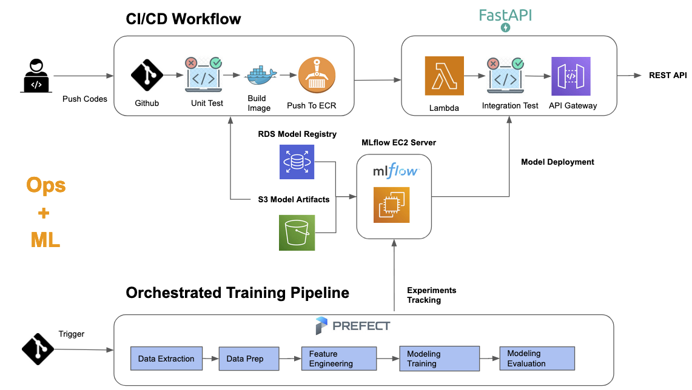

# Movielens 1m Movie Recommendation Serving Based on Behavior Sequence Transformer Model MLOps


## Introduction
#### This repository is to deploy transformer-based movie recommendation as a Serverless API trained by Movielens dataset to predict what movie users like most according to their basic demographic feature and sequence of movie views.

#### Training pipeline is at the different repository: Please refer this github repo: https://github.com/Nelsonlin0321/ml-bst-movielens1m-recommender-training to know more about how we trained the model with MLflow and Prefect Orchestration


#### How to deploy your own Mlflow on EC2: Please refer this instruction: https://github.com/Nelsonlin0321/mlops-zoomcamp/blob/main/02-experiment-tracking/mlflow_on_aws.md

## MLOps Workflow
</img>


## MLOps Features

| Features | Description | Implemented |
| --- | --- | --- | 
| Experiment tracking and model registry  | We track the model training experiment and register models using [Mlflow](https://mlflow.org/)  | ✔️ |
| Workflow Orchestration| We use [Prefect](https://www.prefect.io/) orchestract training data pipeline   | ✔️ |
| Model deployment| Model with FastAPI Deployed to AWS Lambda With API Gateway   | ✔️ |
| Reproducibility | We log all training artifact to make sure reproducibility| ✔️ |
| Best practices (DevOps) | Pylint static code analysis | ✔️ |
| Best practices (DevOps)  | Unit tests in CICD to make sure continue integration | ✔️ |
| Best practices (DevOps) | Integration test in CICD to make sure continue delivery | ✔️ |
| Best practices (DevOps) | Implement CI/CD using Github action workflow | ✔️ |
| Best practices (DevOps) | Terraform Infrastructure as Codes | ✔️ |


## Guidance to Deploy

### Environment Settings

.env file

AWS Secrets are used to download s3 artifacts.
You can use the repository artifacts but you have to remove "artifacts" from .dockerignore 

```sh
export AWS_DEFAULT_REGION=
export AWS_ACCESS_KEY_ID=
export AWS_SECRET_ACCESS_KEY=
export ARTIFACTS_URL=s3://s3-mlflow-artifacts-storage/mlflow/15/7008c7131367497a8dd99e2b2d506f96
export PORT=5050
export WORKERS=2
export THREADS=2
export BATCH_SIZE=1024
```


### Run Recommender API Locally


```sh
python -m venv venv
source venv/bin/activate
pip3 install -r requirements.txt
pip3 install torch --index-url https://download.pytorch.org/whl/cpu

source .env
uvicorn server:app --reload-dir src --host 0.0.0.0 --port 8000
```

### Run Recommender API Using Docker

#### Build the docker
```sh
docker build -t bst-movielens1m-recommender-serving:latest . --platform linux/arm64/v8
```

docker.env
```sh
AWS_DEFAULT_REGION=ap-southeast-1
AWS_ACCESS_KEY_ID=
AWS_SECRET_ACCESS_KEY=
ARTIFACTS_URL=
PORT=5050
WORKERS=2
THREADS=2
BATCH_SIZE=256
```

#### Run Docker Container
```sh
docker run --env-file docker.env -p 5050:5050 -it bst-movielens1m-recommender-serving:latest
```
or
```sh
docker compose up
```

### Call The API

fastapi docs swagger for information: the http://0.0.0.0:8000/docs

```sh
curl -X 'POST' \
  'http://0.0.0.0:5050/recommend' \
  -H 'accept: application/json' \
  -H 'Content-Type: application/json' \
  -d '{
  "movie_ids": [
    1,
    2,
    3,
    4,
    5
  ],
  "user_age": 20,
  "sex": "M",
  "topk": 3
}'
```

### Build AWS Lambda FastAPI Container

```sh
image_name=movielens1m-recommender-lambda
docker build -t ${image_name}:latest -f ./Dockerfile.aws.lambda  . --platform linux/arm64/v8
```

## Test the Lambda
```sh
image_name=movielens1m-recommender-lambda
docker run --env-file docker.env -p 9000:8080 --name lambda-recommender -it --rm ${image_name}:latest
```

```sh
# for debug
docker exec -it lambda-recommender /bin/bash
```


```sh
# TEST healthcheck
curl -XPOST "http://localhost:9000/2015-03-31/functions/function/invocations" -d '{
    "resource": "/healthcheck",
    "path": "/healthcheck",
    "httpMethod": "GET",
    "requestContext": {
    },
    "isBase64Encoded": false
}'

# OUTPUT
# {"statusCode": 200, "headers": {"content-length": "95", "content-type": "application/json"}, "multiValueHeaders": {}, "body": "{\"message\":\"The server is up since 2023-08-12 03:57:28\",\"start_uct_time\":\"2023-08-12 03:57:28\"}", "isBase64Encoded": false}% 

# TEST Recommend Endpoint
curl -XPOST "http://localhost:9000/2015-03-31/functions/function/invocations" -d '{
    "resource": "/recommend",
    "path": "/recommend",
    "httpMethod": "POST",
    "requestContext": {
        "resourcePath": "/recommend",
        "httpMethod": "POST"
    },
    "body": "{\"movie_ids\": [1, 2, 3, 4], \"user_age\": 23, \"sex\": \"M\", \"topk\": 1}",
    "isBase64Encoded": false
}'

#OUTPUT
# {"statusCode": 200, "headers": {"content-length": "154", "content-type": "application/json"}, "multiValueHeaders": {}, "body": "[{\"movie_id\":50,\"title\":\"Usual Suspects, The (1995)\",\"genres\":[\"Crime\",\"Thriller\"],\"release_year\":1995,\"origin_title\":\"Usual Suspects, The\",\"rating\":5.0}]", "isBase64Encoded": false}% 
```


### Push To ECR

```sh
source .env
account_id=932682266260
region=ap-southeast-1
image_name=movielens1m-recommender-lambda
repo_name=${image_name}
aws ecr get-login-password --region ${region} | docker login --username AWS --password-stdin ${account_id}.dkr.ecr.${region}.amazonaws.com
```

```sh
aws ecr create-repository \
    --repository-name ${repo_name} \
    --region ${region}
```

```sh
docker tag ${image_name}:latest ${account_id}.dkr.ecr.${region}.amazonaws.com/${repo_name}:latest
```

```sh
docker push ${account_id}.dkr.ecr.ap-southeast-1.amazonaws.com/${repo_name}:latest
```

### Deploy To AWS with Infra Codes:

```sh
cd ./infra
terraform init
terraform apply
```

### Get API URL
```sh
terraform output -json > ./output.json
```

```json
{
  "apigateway_invoke_url": {
    "sensitive": false,
    "type": "string",
    "value": "https://7jufjyexya.execute-api.ap-southeast-1.amazonaws.com/prod"
  }
}
```

### Test API

```sh
curl -X 'POST' \
  'https://7jufjyexya.execute-api.ap-southeast-1.amazonaws.com/prod/recommend' \
  -H 'accept: application/json' \
  -H 'Content-Type: application/json' \
  -d '{
  "movie_ids": [ 3903, 3914, 3617 ],
  "user_age": 20,
  "sex": "M",
  "topk": 3
}'
```
Recommendation Response:
```json
[
    {
        "movie_id": 50,
        "title": "Usual Suspects, The (1995)",
        "genres": [
            "Crime",
            "Thriller"
        ],
        "release_year": 1995,
        "origin_title": "Usual Suspects, The",
        "predicted_rating": 5.0
    },
    {
        "movie_id": 527,
        "title": "Schindler's List (1993)",
        "genres": [
            "Drama",
            "War"
        ],
        "release_year": 1993,
        "origin_title": "Schindler's List",
        "predicted_rating": 5.0
    },
    {
        "movie_id": 750,
        "title": "Dr. Strangelove or: How I Learned to Stop Worrying and Love the Bomb (1963)",
        "genres": [
            "Sci-Fi",
            "War"
        ],
        "release_year": 1963,
        "origin_title": "Dr. Strangelove or: How I Learned to Stop Worrying and Love the Bomb",
        "predicted_rating": 5.0
    }
]
```

```sh
curl -X 'GET' \
  'https://7jufjyexya.execute-api.ap-southeast-1.amazonaws.com/prod/healthcheck' \
  -H 'accept: application/json' \
  -H 'Content-Type: application/json'
```

heathcheck Response:
```sh
{"message":"The server is up since 2023-08-13 07:52:09","start_uct_time":"2023-08-13 07:52:09"}
```

